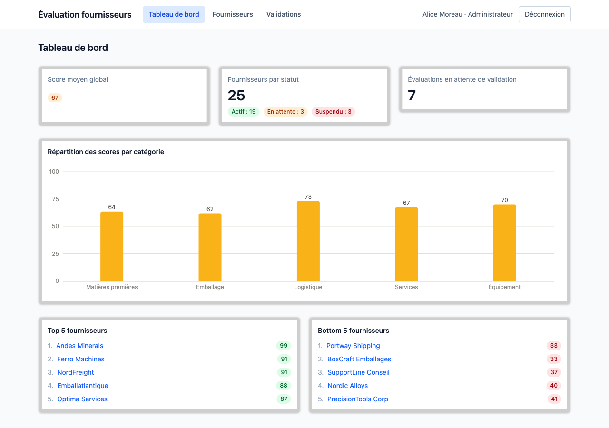

# Évaluation Fournisseurs

Application web permettant à un service achats d'évaluer ses fournisseurs selon des critères pondérés, à la place d'un processus manuel sur tableur. Chaque évaluateur note un fournisseur critère par critère (qualité, délais, prix...), le score global est calculé automatiquement, puis un administrateur valide ou renvoie l'évaluation en brouillon. Un tableau de bord donne une vue d'ensemble : classement des fournisseurs, répartition des scores par catégorie, évaluations en attente.

Projet de démonstration pour portfolio — toutes les données (fournisseurs, contacts, évaluations) sont fictives.

## Aperçu



## Stack technique

| | |
|---|---|
| **Frontend** | React 18, TypeScript, Vite, React Router, TanStack Query, React Hook Form + Zod, Tailwind CSS, Recharts |
| **Backend** | Node.js, Express, TypeScript, PostgreSQL, Prisma, JWT, Zod, bcrypt |
| **Outils** | ESLint + Prettier, Docker Compose, Vitest |

## Installation et lancement

### Prérequis

- Node.js 22+
- Docker (pour PostgreSQL)

### Étapes

```bash
# 1. Installer les dépendances (toutes les workspaces)
npm install

# 2. Copier les fichiers d'environnement
cp .env.example .env
cp server/.env.example server/.env
cp client/.env.example client/.env

# 3. Démarrer PostgreSQL
docker compose up -d

# 4. Appliquer les migrations et charger les données de démonstration
npm run db:migrate
npm run db:seed

# 5. Démarrer le backend et le frontend en parallèle
npm run dev
```

L'application est accessible sur **http://localhost:5173** (l'API tourne sur `http://localhost:3000`).

### Lancer les tests

```bash
npm run test
```

## Identifiants de démonstration

Créés par le script de seed (`npm run db:seed`), mot de passe commun `Demo1234!` :

| Rôle | Email | Mot de passe |
|---|---|---|
| Administrateur | `admin@example.com` | `Demo1234!` |
| Évaluateur | `evaluateur@example.com` | `Demo1234!` |

L'administrateur valide les évaluations soumises et peut créer des fournisseurs ; l'évaluateur crée et soumet les évaluations. Il n'y a pas d'inscription publique.

## Choix techniques

**Monorepo npm workspaces** (`client` / `server` / `shared`) : le dossier `shared` contient les enums, les schémas de validation Zod et la fonction de calcul de score, importés tels quels par les deux applications. Un schéma de validation (ex. `evaluationInputSchema`) est ainsi défini une seule fois et réutilisé pour la validation du formulaire côté client (React Hook Form + `zodResolver`) et pour la validation des requêtes côté serveur (middleware Express) — pas de duplication des règles métier entre les deux couches.

**Authentification par cookie httpOnly** plutôt que par token stocké en `localStorage` : le JWT n'est jamais accessible en JavaScript côté client, ce qui réduit la surface d'exposition en cas de faille XSS. Le frontend ne gère pas de store d'authentification global — le cache de la requête `['auth', 'me']` de TanStack Query fait office d'état d'authentification partagé entre tous les composants.

**Calcul du score global** : centralisé dans `shared/src/scoring.ts` (`computeGlobalScore`), utilisé à la fois pour l'aperçu en temps réel pendant la saisie côté client et pour la valeur persistée côté serveur — une seule implémentation, testée en Vitest. La formule est une moyenne pondérée des notes (1 à 5) par le poids de leur critère, ramenée sur une échelle de 0 à 100 :

```
score = (Σ note_i × poids_i) / (Σ poids_i) × 20
```

**Prisma + PostgreSQL** : le schéma relationnel (`server/prisma/schema.prisma`) porte les contraintes métier directement en base — notamment l'unicité (fournisseur, évaluateur, période) qui empêche une double évaluation, revalidée aussi côté application pour un message d'erreur clair.

**Aucune donnée n'est approuvée sans revalidation serveur** : les règles de la spec (toutes les notes requises avant soumission, brouillon seul modifiable, unicité par période...) sont vérifiées côté client pour le confort d'usage, mais systématiquement revérifiées côté serveur avant toute écriture en base.

## Structure du dépôt

```
.
├── client/          # Frontend React + Vite
├── server/          # API Express + Prisma
├── shared/          # Types, schémas Zod et logique de score partagés
├── docker-compose.yml
└── package.json     # Workspaces racine
```
